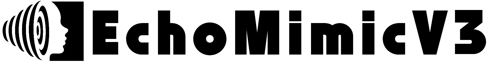
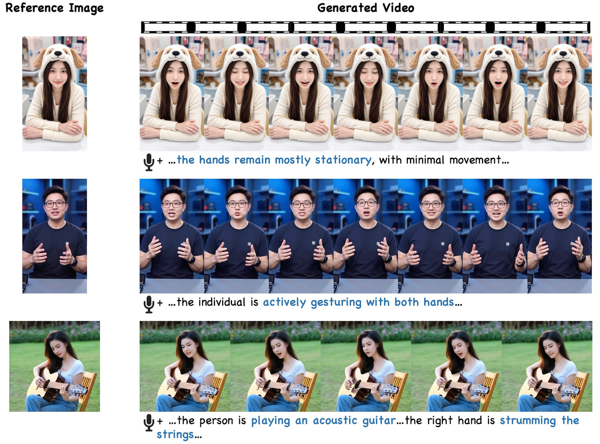

<p align="center">
  
</p>

<h1 align='center'>EchoMimicV3: 1.3B Parameters are All You Need for Unified Multi-Modal and Multi-Task Human Animation</h1>

<div align='center'>
    <a href='https://github.com/mengrang' target='_blank'>Rang Meng</a></sup>&emsp;
    <a href='https://github.com/' target='_blank'>Yan Wang</a>&emsp;
    <a href='https://github.com/' target='_blank'>Weipeng Wu</a>&emsp;
    <a href='https://github.com/' target='_blank'>Ruobing Zheng</a>&emsp;
    <a href='https://lymhust.github.io/' target='_blank'>Yuming Li</a></sup>&emsp;
    <a href='https://github.com/' target='_blank'>Chenguang Ma</a></sup>
</div>

<div align='center'>
Terminal Technology Department, Alipay, Ant Group.
</div>
<br>
<div align='center'>
    <a href='https://antgroup.github.io/ai/echomimic_v3/'></a>
    <!-- <a href='https://huggingface.co/BadToBest/EchoMimicV3'></a> -->
    <!--<a href='https://antgroup.github.io/ai/echomimic_v2/'></a>-->
    <!-- <a href='https://modelscope.cn/models/BadToBest/EchoMimicV3'></a> -->
    <!--<a href='https://antgroup.github.io/ai/echomimic_v2/'></a>-->
    <a href='https://arxiv.org/abs/2507.03905'></a>
    <!-- <a href='https://openaccess.thecvf.com/content/CVPR2025/papers/Meng_EchoMimicV2_Towards_Striking_Simplified_and_Semi-Body_Human_Animation_CVPR_2025_paper.pdf'></a> -->
    <!-- <a href='https://github.com/antgroup/echomimic_v2/blob/main/assets/halfbody_demo/wechat_group.png'></a> -->
</div>
<!-- <div align='center'>
    <a href='https://github.com/antgroup/echomimic_v3/discussions/0'></a>
    <a href='https://github.com/antgroup/echomimic_v3/discussions/1'></a>
</div> -->

## &#x1F680; EchoMimic Series
* EchoMimicV3: 1.3B Parameters are All You Need for Unified Multi-Modal and Multi-Task Human Animation. [GitHub](https://github.com/antgroup/echomimic_v3)
* EchoMimicV2: Towards Striking, Simplified, and Semi-Body Human Animation. [GitHub](https://github.com/antgroup/echomimic_v2)
* EchoMimicV1: Lifelike Audio-Driven Portrait Animations through Editable Landmark Conditioning. [GitHub](https://github.com/antgroup/echomimic)


## &#x1F4E3; Updates
<!-- * [2025.02.27] 🔥 EchoMimicV2 is accepted by CVPR 2025.
* [2025.01.16] 🔥 Please check out the [discussions](https://github.com/antgroup/echomimic_v2/discussions) to learn how to start EchoMimicV2.
* [2025.01.16] 🚀🔥 [GradioUI for Accelerated EchoMimicV2](https://github.com/antgroup/echomimic_v2/blob/main/app_acc.py) is now available.
* [2025.01.03] 🚀🔥 **One Minute is All You Need to Generate Video**. [Accelerated EchoMimicV2](https://github.com/antgroup/echomimic_v2/blob/main/infer_acc.py) are released. The inference speed can be improved by 9x (from ~7mins/120frames to ~50s/120frames on A100 GPU).
* [2024.12.16] 🔥 [RefImg-Pose Alignment Demo](https://github.com/antgroup/echomimic_v2/blob/main/demo.ipynb) is now available, which involves aligning reference image, extracting pose from driving video, and generating video.
* [2024.11.27] 🔥 [Installation tutorial](https://www.youtube.com/watch?v=2ab6U1-nVTQ) is now available. Thanks [AiMotionStudio](https://www.youtube.com/@AiMotionStudio) for the contribution.
* [2024.11.22] 🔥 [GradioUI](https://github.com/antgroup/echomimic_v2/blob/main/app.py) is now available. Thanks @gluttony-10 for the contribution.
* [2024.11.22] 🔥 [ComfyUI](https://github.com/smthemex/ComfyUI_EchoMimic) is now available. Thanks @smthemex for the contribution.
* [2024.11.21] 🔥 We release the EMTD dataset list and processing scripts.
* [2024.11.21] 🔥 We release our [EchoMimicV2](https://github.com/antgroup/echomimic_v2) codes and models. -->
* [2025.07.08] 🔥 Our [paper](https://arxiv.org/abs/2507.03905) is in public on arxiv.

## &#x1F305; Gallery
<p align="center">
  
</p>
<table class="center">
<tr>
    <td width=100% style="border: none">
        <video controls loop src="https://github.com/user-attachments/assets/f33edb30-66b1-484b-8be0-a5df20a44f3b" muted="false"></video>
    </td>
</tr>
</table>
For more demo videos, please refer to the project page.

<!-- 
## ⚒️ Automatic Installation
### Download the Codes

```bash
  git clone https://github.com/antgroup/echomimic_v3
  cd echomimic_v2
```
### Automatic Setup
- CUDA >= 11.7, Python == 3.10

```bash
   sh linux_setup.sh
```
## ⚒️ Manual Installation
### Download the Codes

```bash
  git clone https://github.com/antgroup/echomimic_v2
  cd echomimic_v2
```
### Python Environment Setup

- Tested System Environment: Centos 7.2/Ubuntu 22.04, Cuda >= 11.7
- Tested GPUs: A100(80G) / RTX4090D (24G) / V100(16G)
- Tested Python Version: 3.8 / 3.10 / 3.11

Create conda environment (Recommended):

```bash
  conda create -n echomimic python=3.10
  conda activate echomimic
```

Install packages with `pip`
```bash
  pip install pip -U
  pip install torch==2.5.1 torchvision==0.20.1 torchaudio==2.5.1 xformers==0.0.28.post3 --index-url https://download.pytorch.org/whl/cu124
  pip install torchao --index-url https://download.pytorch.org/whl/nightly/cu124
  pip install -r requirements.txt
  pip install --no-deps facenet_pytorch==2.6.0
```

### Download ffmpeg-static
Download and decompress [ffmpeg-static](https://www.johnvansickle.com/ffmpeg/old-releases/ffmpeg-4.4-amd64-static.tar.xz), then
```
export FFMPEG_PATH=/path/to/ffmpeg-4.4-amd64-static
```

### Download pretrained weights

```shell
git lfs install
git clone https://huggingface.co/BadToBest/EchoMimicV3 pretrained_weights
```

The **pretrained_weights** is organized as follows.

```
./pretrained_weights/
├── denoising_unet.pth
├── reference_unet.pth
├── motion_module.pth
├── pose_encoder.pth
├── sd-vae-ft-mse
│   └── ...
└── audio_processor
    └── tiny.pt
```

In which **denoising_unet.pth** / **reference_unet.pth** / **motion_module.pth** / **pose_encoder.pth** are the main checkpoints of **EchoMimic**. Other models in this hub can be also downloaded from it's original hub, thanks to their brilliant works:
- [sd-vae-ft-mse](https://huggingface.co/stabilityai/sd-vae-ft-mse)
- [audio_processor(whisper)](https://openaipublic.azureedge.net/main/whisper/models/65147644a518d12f04e32d6f3b26facc3f8dd46e5390956a9424a650c0ce22b9/tiny.pt)

### Inference on Demo 
Run the gradio:
```bash
python app.py
```
Run the python inference script:
```bash
python infer.py --config='./configs/prompts/infer.yaml'
```

Run the python inference script for accelerated version. Make sure to check out the configuration for accelerated inference:
```bash
python infer_acc.py --config='./configs/prompts/infer_acc.yaml'
```

### EMTD Dataset
Download dataset:
```bash
python ./EMTD_dataset/download.py
```
Slice dataset:
```bash
bash ./EMTD_dataset/slice.sh
```
Process dataset:
```bash
python ./EMTD_dataset/preprocess.py
```
Make sure to check out the [discussions](https://github.com/antgroup/echomimic_v3/discussions) to learn how to start the inference.
-->
## 📝 TODO List
| Status | Milestone                                                                |     
|:--------:|:-------------------------------------------------------------------------|
|    🚀    | The inference code of EchoMimicV3 meet everyone on GitHub   | 
|    🚀    | Preview version Pretrained models trained on English and Chinese on HuggingFace | 
|    🚀    | Preview version Pretrained models trained on English and Chinese on ModelScope   | 
|    🚀    | 720P Pretrained models trained on English and Chinese on HuggingFace | 
|    🚀    | 720P Pretrained models trained on English and Chinese on ModelScope   | 
|    🚀    | The training code of EchoMimicV2 meet everyone on GitHub   | 


<!-- 
## ⚖️ Disclaimer
This project is intended for academic research, and we explicitly disclaim any responsibility for user-generated content. Users are solely liable for their actions while using the generative model. The project contributors have no legal affiliation with, nor accountability for, users' behaviors. It is imperative to use the generative model responsibly, adhering to both ethical and legal standards.

## 🙏🏻 Acknowledgements

We would like to thank the contributors to the [MimicMotion](https://github.com/Tencent/MimicMotion) and [Moore-AnimateAnyone](https://github.com/MooreThreads/Moore-AnimateAnyone) repositories, for their open research and exploration. 

We are also grateful to [CyberHost](https://cyberhost.github.io/) and [Vlogger](https://enriccorona.github.io/vlogger/) for their outstanding work in the area of audio-driven human animation.

If we missed any open-source projects or related articles, we would like to complement the acknowledgement of this specific work immediately. -->

## &#x1F4D2; Citation

If you find our work useful for your research, please consider citing the paper :

```
@misc{meng2025echomimicv3,
  title={EchoMimicV3: 1.3B Parameters are All You Need for Unified Multi-Modal and Multi-Task Human Animation},
  author={Rang Meng, Yan Wang, Weipeng Wu, Ruobing Zheng, Yuming Li, Chenguang Ma},
  year={2025},
  eprint={2507.03905},
  archivePrefix={arXiv}
}
```

## &#x1F31F; Star History
[](https://www.star-history.com/#antgroup/echomimic_v3&Date)
